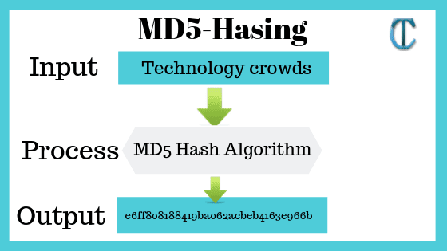

</img>

# Theory of Algorithms Project

>Title: MD5 message-digest algorithm
>
>Author: Slav Lukyanov
>
>Student-ID: G00339839
>
>Module: Theory of Algorithms
>
>Year: 4
>
>Lecturer: Ian McLoughlin

## Introduction

# MD5 (MD5 message-digest algorithm)
MD5 processes a variable-length message (file as input) into a fixed-length output of 128 bits.
This MD5 was written in C as part of my studies in GMIT in the Theory of Algorithms module.

